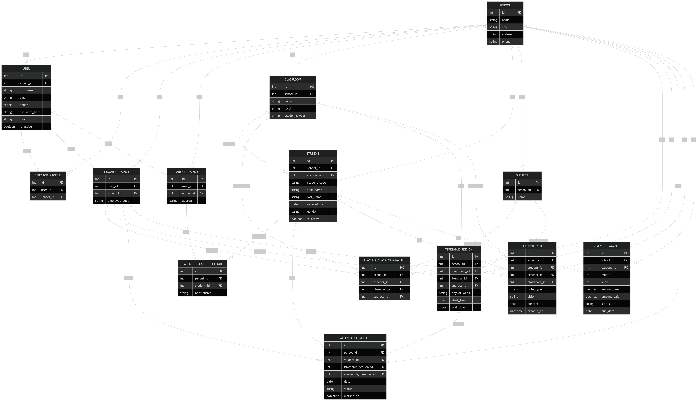

# Entities and Relationships Document — School Management Platform MVP

## 1. Purpose

This document describes the main database entities and relationships for the School Management Platform MVP.

The goal is to make the data structure clear before starting backend development.

This document should help Codex understand:

* What entities exist
* What each entity means
* How entities are connected
* What constraints should be respected
* What permissions depend on these relationships

---

## 2. ERD Diagram

The following diagram represents the main MVP database structure:



---

## 3. Main Entities

The MVP will contain these main entities:

1. User
2. School
3. DirectorProfile
4. TeacherProfile
5. ParentProfile
6. Student
7. ClassRoom
8. Subject
9. TeacherClassAssignment
10. ParentStudentRelation
11. TimetableSession
12. AttendanceRecord
13. TeacherNote
14. StudentPayment

---

## 4. Entity Descriptions

### 4.1 User

Represents any person who can log in to the platform.

User roles:

* Director
* Teacher
* Parent

A student does not have a login account in the MVP.

Main fields:

* id
* school_id
* full_name
* email
* phone
* password_hash
* role
* is_active

---

### 4.2 School

Represents the private school using the platform.

One school can have many users, students, classes, teachers, parents, subjects, sessions, attendance records, notes, and payments.

Main fields:

* id
* name
* city
* address
* phone

---

### 4.3 DirectorProfile

Represents the director/admin profile.

Each director belongs to one school.

Main fields:

* id
* user_id
* school_id

---

### 4.4 TeacherProfile

Represents a teacher/professor.

Each teacher belongs to one school.

Main fields:

* id
* user_id
* school_id
* employee_code

---

### 4.5 ParentProfile

Represents a parent or guardian.

Each parent belongs to one school.

A parent can have one or more children.

Main fields:

* id
* user_id
* school_id
* address

---

### 4.6 Student

Represents a student.

Each student belongs to one school and one class.

A student can be linked to one or more parents.

The student does not log in during the MVP.

Main fields:

* id
* school_id
* classroom_id
* student_code
* first_name
* last_name
* date_of_birth
* gender
* is_active

---

### 4.7 ClassRoom

Represents a school class.

Examples:

* 1AC A
* 2AC B
* 3AC A

Each class belongs to one school.

A class has many students.

Main fields:

* id
* school_id
* name
* level
* academic_year

---

### 4.8 Subject

Represents a school subject.

Examples:

* Mathematics
* Arabic
* French
* Physics

Each subject belongs to one school.

Main fields:

* id
* school_id
* name

---

### 4.9 TeacherClassAssignment

Connects a teacher with a class and subject.

Example:

Teacher Yassine teaches Mathematics to class 2AC A.

Main fields:

* id
* school_id
* teacher_id
* classroom_id
* subject_id

This entity is important because:

* One teacher can teach many classes.
* One class can have many teachers.
* One subject can be taught in many classes.
* The system can know which teacher is allowed to access which class.

---

### 4.10 ParentStudentRelation

Connects a parent to a student.

Example:

Mohamed Alami is the father of Ahmed Alami.

This allows:

* One parent to have many children.
* One student to be linked to more than one parent or guardian.

Main fields:

* id
* parent_id
* student_id
* relationship

Example relationship values:

* Father
* Mother
* Guardian

---

### 4.11 TimetableSession

Represents a class session in the timetable.

Example:

Monday, 08:00–10:00, Mathematics, 2AC A, Teacher Yassine.

Main fields:

* id
* school_id
* classroom_id
* teacher_id
* subject_id
* day_of_week
* start_time
* end_time

This entity allows attendance to be tracked by session, not only by day.

---

### 4.12 AttendanceRecord

Represents the attendance of one student in one timetable session on a specific date.

Example:

Ahmed was present in Mathematics on Monday from 08:00 to 10:00.

Main fields:

* id
* school_id
* student_id
* timetable_session_id
* marked_by_teacher_id
* date
* status
* marked_at

Attendance status values:

* Present
* Absent
* Late
* Excused
* Not marked

Important rule:

A student should have only one attendance record for the same session and date.

---

### 4.13 TeacherNote

Represents a note written by a teacher about a student.

Example:

Ahmed did not bring homework.

Main fields:

* id
* school_id
* student_id
* teacher_id
* classroom_id
* note_type
* title
* content
* created_at

Note type examples:

* Behavior
* Homework
* Performance
* Discipline
* General

---

### 4.14 StudentPayment

Represents the payment status of a student for a specific month.

Example:

Ahmed paid 800 MAD for June 2026.

Main fields:

* id
* school_id
* student_id
* month
* year
* amount_due
* amount_paid
* status
* due_date

Payment status values:

* Paid
* Unpaid
* Partial
* Late

Online payment is not part of the MVP.

Payments are tracked manually by the director/admin.

---

## 5. Relationships Table

| Entity 1         | Relationship | Entity 2                | Meaning                                            |
| ---------------- | ------------ | ----------------------- | -------------------------------------------------- |
| School           | has many     | Users                   | A school has directors, teachers, and parents      |
| School           | has many     | Students                | A school manages many students                     |
| School           | has many     | ClassRooms              | A school has many classes                          |
| School           | has many     | Subjects                | A school has many subjects                         |
| School           | has many     | TimetableSessions       | A school has many timetable sessions               |
| School           | has many     | AttendanceRecords       | A school has many attendance records               |
| School           | has many     | TeacherNotes            | A school has many teacher notes                    |
| School           | has many     | StudentPayments         | A school tracks student payments                   |
| User             | has one      | DirectorProfile         | A director user has one director profile           |
| User             | has one      | TeacherProfile          | A teacher user has one teacher profile             |
| User             | has one      | ParentProfile           | A parent user has one parent profile               |
| DirectorProfile  | belongs to   | School                  | A director manages one school                      |
| TeacherProfile   | belongs to   | School                  | A teacher works in one school                      |
| ParentProfile    | belongs to   | School                  | A parent is linked to one school                   |
| ClassRoom        | belongs to   | School                  | A class exists inside one school                   |
| ClassRoom        | has many     | Students                | A class contains many students                     |
| Student          | belongs to   | School                  | A student studies in one school                    |
| Student          | belongs to   | ClassRoom               | A student is assigned to one class                 |
| ParentProfile    | has many     | ParentStudentRelations  | A parent can be linked to many students            |
| Student          | has many     | ParentStudentRelations  | A student can be linked to more than one parent    |
| TeacherProfile   | has many     | TeacherClassAssignments | A teacher can teach many classes and subjects      |
| ClassRoom        | has many     | TeacherClassAssignments | A class can have many teachers and subjects        |
| Subject          | has many     | TeacherClassAssignments | A subject can be assigned to many teachers/classes |
| ClassRoom        | has many     | TimetableSessions       | A class has many timetable sessions                |
| TeacherProfile   | has many     | TimetableSessions       | A teacher can have many sessions                   |
| Subject          | has many     | TimetableSessions       | A subject appears in many sessions                 |
| TimetableSession | has many     | AttendanceRecords       | A session has attendance records for students      |
| Student          | has many     | AttendanceRecords       | A student has attendance history                   |
| TeacherProfile   | creates many | AttendanceRecords       | A teacher marks attendance                         |
| Student          | has many     | TeacherNotes            | A student can have many notes                      |
| TeacherProfile   | creates many | TeacherNotes            | A teacher writes notes                             |
| ClassRoom        | has many     | TeacherNotes            | Notes can be linked to the class context           |
| Student          | has many     | StudentPayments         | A student has monthly payments                     |

---

## 6. Relationship Summary

### 6.1 School

School is the main owner of the data.

Almost every important entity belongs to a school.

This is important because later the platform can support many schools.

For the MVP, the system can start with one school, but the database should already support multiple schools.

---

### 6.2 User

User is used for login.

A user can be:

* Director
* Teacher
* Parent

Each user has one profile based on their role.

A student does not have a user account in the MVP.

---

### 6.3 Student

Student is connected to:

* School
* ClassRoom
* ParentProfile
* AttendanceRecord
* TeacherNote
* StudentPayment

Student does not log in during the MVP.

The school manages student data.

---

### 6.4 Teacher

Teacher is connected to:

* School
* Classes
* Subjects
* Timetable sessions
* Attendance records
* Teacher notes

A teacher can only access assigned classes and assigned sessions.

---

### 6.5 Parent

Parent is connected to:

* School
* One or more students

A parent can view only their own children through the ParentStudentRelation entity.

---

### 6.6 Director

Director is connected to:

* User
* School

The director can manage and view all MVP data inside their school.

---

## 7. Core Database Logic

### 7.1 One School Has Many Students

A school can manage many students.

Each student belongs to one school.

---

### 7.2 One Class Has Many Students

A class can contain many students.

Each student belongs to one class.

---

### 7.3 One Parent Can Have Many Students

A parent can have more than one child.

This is handled using ParentStudentRelation.

---

### 7.4 One Student Can Have More Than One Parent

A student can be linked to father, mother, or guardian.

This is handled using ParentStudentRelation.

---

### 7.5 One Teacher Can Teach Many Classes

A teacher can teach different classes.

This is handled using TeacherClassAssignment.

---

### 7.6 One Class Can Have Many Teachers

A class can have many teachers because each subject may have a different teacher.

This is handled using TeacherClassAssignment.

---

### 7.7 Attendance Is by Session

Attendance is connected to a timetable session, not only to a day.

This allows the system to know if a student was present, absent, late, or excused for each session.

---

### 7.8 Payment Is by Student and Month

Each student has payment records per month and year.

This allows the director to track paid, unpaid, partial, and late payment statuses.

---

## 8. Important Constraints

### 8.1 User Role Constraint

Each user must have one role:

* Director
* Teacher
* Parent

A user should only have the profile that matches their role.

Example:

* A teacher user should have a TeacherProfile.
* A parent user should have a ParentProfile.
* A director user should have a DirectorProfile.

---

### 8.2 Student Attendance Constraint

A student should have only one attendance record for the same timetable session and date.

Rule:

```txt
Student + TimetableSession + Date must be unique.
```

---

### 8.3 Payment Constraint

A student should have only one payment record for the same month and year.

Rule:

```txt
Student + Month + Year must be unique.
```

---

### 8.4 Teacher Class Assignment Constraint

A teacher should not have duplicate assignments for the same class and subject.

Rule:

```txt
Teacher + ClassRoom + Subject must be unique.
```

---

### 8.5 Parent Student Relation Constraint

The same parent should not be linked to the same student more than once.

Rule:

```txt
Parent + Student must be unique.
```

---

### 8.6 Parent Access Constraint

A parent can only see students connected to them through ParentStudentRelation.

---

### 8.7 Teacher Access Constraint

A teacher can only see classes, students, sessions, attendance records, and notes related to their assignments.

---

### 8.8 Director Access Constraint

A director can see all data inside their school.

A director should not see data from another school.

---

## 9. Permissions Based on Relationships

### 9.1 Director Permissions

The director can:

* Manage school data
* Manage users
* Manage teachers
* Manage parents
* Manage students
* Manage classes
* Manage subjects
* Manage timetable sessions
* View and manage attendance
* View and manage payments
* View teacher notes
* View dashboard statistics

---

### 9.2 Teacher Permissions

The teacher can:

* View assigned classes
* View assigned sessions
* View students in assigned classes
* Mark attendance for assigned sessions
* Add notes for students in assigned classes
* View previous notes for assigned students

The teacher cannot:

* Manage payments
* Manage parents
* Manage all school students
* Access unrelated classes
* Access unrelated sessions

---

### 9.3 Parent Permissions

The parent can:

* View their own children
* View attendance for their own children
* View attendance calendar for their own children
* View basic child information

The parent cannot:

* View other students
* Mark attendance
* Edit student data
* View teacher/admin dashboards
* View school-wide data

---

## 10. Final Entity List for MVP

| Entity                 | Purpose                             |
| ---------------------- | ----------------------------------- |
| User                   | Login and role management           |
| School                 | School account/organization         |
| DirectorProfile        | Director/admin details              |
| TeacherProfile         | Teacher details                     |
| ParentProfile          | Parent details                      |
| Student                | Student profile                     |
| ClassRoom              | School class                        |
| Subject                | School subject                      |
| TeacherClassAssignment | Connect teacher, class, and subject |
| ParentStudentRelation  | Connect parent and child            |
| TimetableSession       | Class schedule/session              |
| AttendanceRecord       | Attendance by session               |
| TeacherNote            | Teacher notes about students        |
| StudentPayment         | Monthly payment tracking            |

---

## 11. MVP Database Priority

The backend should create the entities in this order:

1. School
2. User
3. DirectorProfile
4. TeacherProfile
5. ParentProfile
6. ClassRoom
7. Subject
8. Student
9. ParentStudentRelation
10. TeacherClassAssignment
11. TimetableSession
12. AttendanceRecord
13. TeacherNote
14. StudentPayment

This order makes development easier because later entities depend on earlier entities.

---

## 12. Final Summary

The MVP database is built around one main idea:

The school owns the data, users access the data based on their role, and students are tracked through classes, sessions, attendance, notes, and payments.

The most important relationship flow is:

```txt
School → ClassRoom → Student → AttendanceRecord
```

The most important user flow is:

```txt
Teacher marks AttendanceRecord → Parent sees child status → Director sees dashboard visibility
```

This database structure should stay simple for the MVP but flexible enough to support future mobile apps and more school features later.
